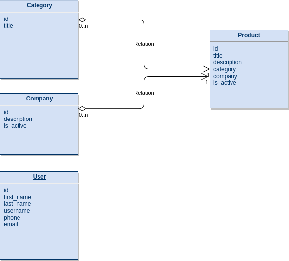

# Тестовое задание для: Python[Django] разработчика

Минимальный набор библиотек необходимый для выполнения:

*   Django ( https://github.com/django )
*   Django Rest Framework ( https://github.com/encode/django-rest-framework )
*   Django filter ( https://github.com/carltongibson/django-filter )

Задачи:

*   Построить структуру БД используя Django ORM.
*   Настроить редактирование этих данных в Django admin.
*   Написать API для получения данных из этих моделей используя DjangoRestFramework и django_filters.

Требуется наличие следующих сущностей:

*   Пользователь* - нужно переопределить стандартного пользователя и добавить необходимые поля.
*   Категория*
*   Компания*
*   Продукт*

*(Обязательность, индексирование и тип данных полей на усмотрение кандидата)

Структура БД:

Требуются следующие ресурсы API:

1. Регистрация пользователя;
2. Авторизация пользователя по DRF токену;
3. Список категорий (авторизация не требуется);
4. Список активных компаний (авторизация не требуется);
5. Список активных продуктов (авторизация не требуется);
    1. фильтрация по компании;
    2. фильтрация по категории;
    3. поиск по неполному наименованию;
6. Детальная карточка продукта (авторизация не требуется);
7. Создание/Изменение/Удаление (**Требуется авторизация**);

Использование Docker / Docker-compose и наличие тестов будет плюсом

В результате ждем от вас ссылку на репозиторий (либо предоставление прав на репозиторий).

Дополнительное задания.

1. Интеграция с внешним сервисом (реализация периодической загрузки данных по интегрированным компаниям и актуализация списка их продуктов)

Необходимо выполнить:

1. Доработать существующие модели для поддержки интеграции с внешним сервисом.
2. Создать периодическую задачу celery или management команду django для запуска через cron.
3. Задача загружает список компаний и добавляет их в базу или обновляет при наличии. В базе данных также могут быть компании без интеграции. Список компаний от внешнего сервиса может только пополнятся новыми компаниями.
4. По интегрированным компаниям выполняется актуализация данных: новые продукты добавляются, отсутствующие удаляются, существующие обновляются. Категории продуктов едины для всех компаний.

Внешний сервис: 

*   [http://otp.spider.ru/test/companies/](http://otp.spider.ru/test/companies/) - список компаний
*   [http://otp.spider.ru/test/companies/](http://otp.spider.ru/test/companies/)<company_id>/products/ - список продуктов с категориями.

	

2. Работа с геоданными (сортировка объектов по удаленности).

Используя модуль GeoDjango, доработать модель компаний, включив в него геопозицию. Позиция указывается вручную в админке django (и не обновляется при загрузке данных). 

Необходимо работать api списка компаний таким образом, чтобы клиент мог передать свои координаты, а api при наличии координат отсортировал компании по удаленности. Расстояние (в км) должно отображаться в выходных данных.
